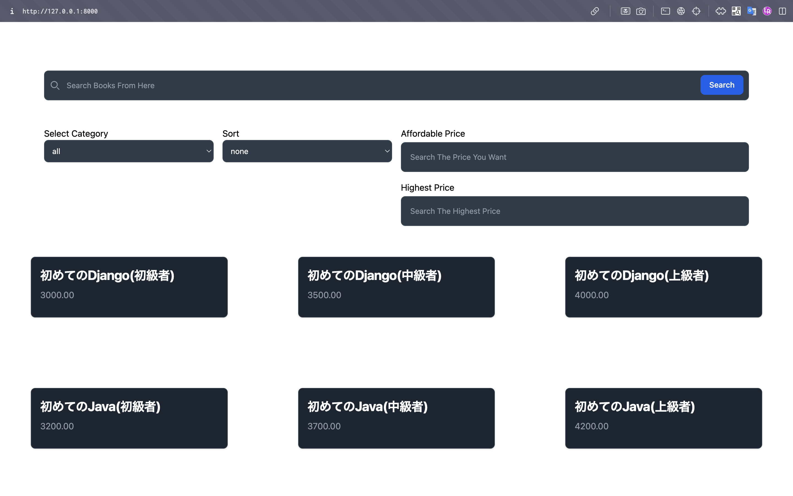

## 👀 Images


<br>

## 😉 How To (Just Click [this](http://18.183.25.105/))
- I deployed this app by using EC2 ([LINK](http://18.183.25.105/))
- if you want to run the app on local, just do this!
```
$ source venv/bin/activate

$ python3 manage.py runserver
```


<br>

## 😀 References
- [tailwindcss](https://zenn.dev/hathle/articles/django-tailwindcss)
- [How to deploy with EC2](https://qiita.com/Bashi50/items/d5bc47eeb9668304aaa2#github%E3%81%8B%E3%82%89%E3%82%AF%E3%83%AD%E3%83%BC%E3%83%B3%E3%81%99%E3%82%8B)
- [How to delete a symbolic link](https://teratail.com/questions/888xjzb1lst4co)